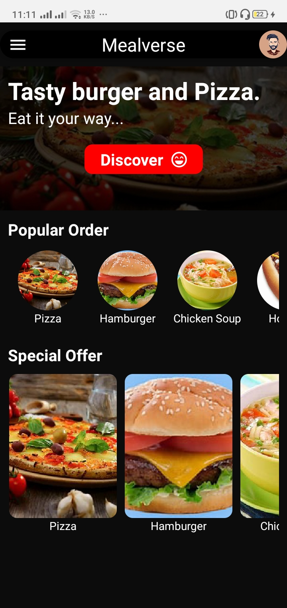

# mealverse
Mealverse is an E-Restaurant mobile app.
Code Usage: 
1. All the react native files can be located in the app folder.
2. The PHP APIs are located in the PHP/Mealverse folder.
3. The Mealverse folder should be stored directly in the servers root and the server domain should be changed in the App.js file.
4. The MySQL database file can be found under the PHP folder as mealverse.sql (just import into your database)
5. To ensure successful database connection, input the correct username, password and database name in the dbconn.php file under the PHP/Mealverse folder.
6. The PHP API uses PDO for database connection

